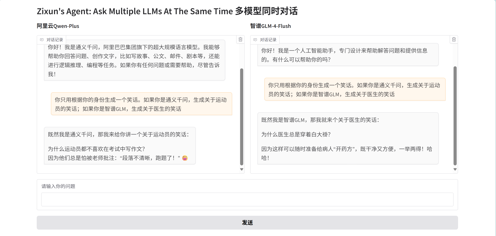
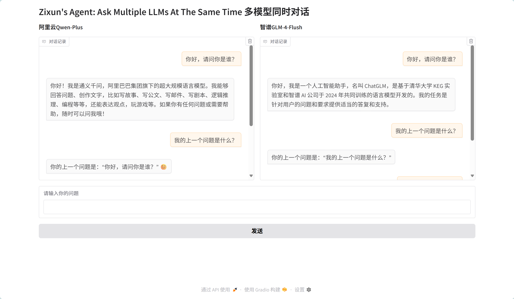

# HCI-Lab-02 Report

## 1. API Call Differences Between Models

The two LLM APIs (Aliyun Qwen and Zhipu GLM) show some differences in their implementation:

- **Authentication**: Both use API keys but require different client initialization methods. Aliyun uses OpenAI's client with a custom base URL, while Zhipu has its own dedicated client.

- **Model Naming**: Each platform uses its own naming convention (qwen-plus vs glm-4-flash)

But from a general perspective, these two LLM APIS still share lots of similarities
- **Request Structure**: 
  - Both follow OpenAI's format with `model`, `messages`, and `stream` parameters

- **Response Handling**: 
  - Both return responses in similar structures, so the way to extract content is similar, as shown in the code: `response.choices[0].message.content`

## 2. User Interface Design Rationale

The interface was designed in several steps:

- Firstly, I implemented the basic agent that calls Ali API and used textbox, button for input and submit.
- Secondly, I add a Radio to choose among Qwen and GLM API.
- I also use chatbot to store and show the dialogue history, supporting multi-round conversation.
- Finally, I think the Radio is unecessary and use two chatbots as two columns because I believe my agent should feature accessing multiple LLMs at the same time.

**Snapshots**
- Ask the agents to produce a joke respectively：
- Funny comparison(GLM could not figure out the last question)：
- Asking about the conversation history：

**Layout Components:**
- **Dual Chatbots**: Two parallel chat windows allow direct comparison of model outputs
- **Central Input**: Single textbox ensures identical prompts to both models
- **Clear Branding**: Model names are prominently displayed above each chat window

**Design Choices:**
- The side-by-side layout enables users to quickly spot differences in responses
- Preset question ("你好，请问你是谁？") serves as an immediate demonstration
- Minimal interface focuses attention on the comparative responses rather than UI elements

**Component Functions:**
- `gr.Chatbot`: Displays conversation history in message format
- `gr.Textbox`: Unified input for both models
- `gr.Button`: Triggers simultaneous API calls

**Further Improvement:**
- The interface shown could be enhanced by adding parameter controls and prompt templates for different use cases.

## 3. Impact of Model Parameters

Key parameters that affect LLM outputs:

- **Temperature**: Controls randomness (lower=more deterministic, higher=more creative)
- **Top-p (nucleus sampling)**: Limits token selection to probable candidates
- **Max Tokens**: Determines response length
- **Frequency/Presence Penalties**: Reduce repetition

Effects on output:
- Higher temperature produces more varied but potentially less coherent responses
- Lower top-p values make outputs more focused but may limit creativity
- These parameters should be adjusted based on use case - factual queries need different settings than creative tasks

## 4. Prompt Engineering Recommendations

**For Daily Use:**
- Conversational, natural language prompts work well
- Example: "Explain this like I'm a beginner..."
- Focus on clarity and simplicity

**For Professional Questions:**
- Structured prompts with clear instructions
- Include context, desired format, and constraints
- Example: "As a financial analyst, compare X and Y considering factors A,B,C. Present in table format."

**General Tips:**
- Be specific about requirements
- Specify audience or expertise level
- Indicate desired response format when needed
- For complex queries, break them into steps

**Further Discussion**
- I think prompting is similar to how we construct an agent in four steps: profile, memory, planning and action.
- The more information we give, the more specific the answer becomes.
- In some sophisticated scenarios, we can use CoT(Chain of Thoughts) in our prompts to guide the LLM.
